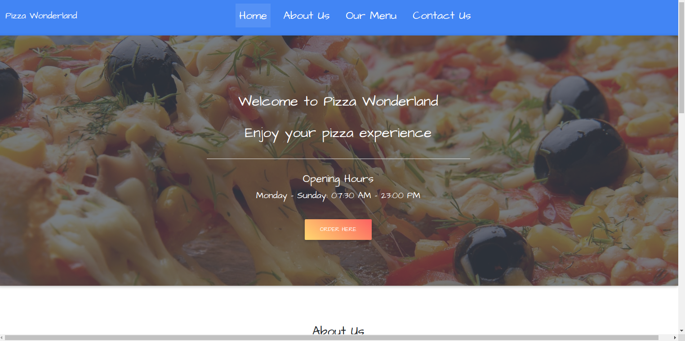
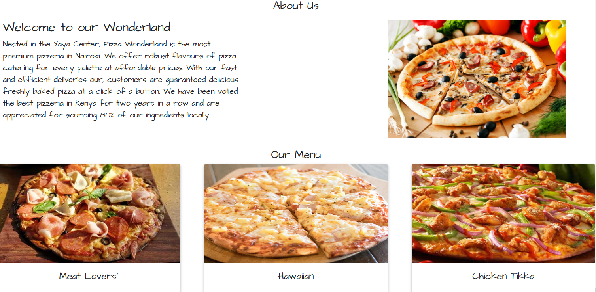
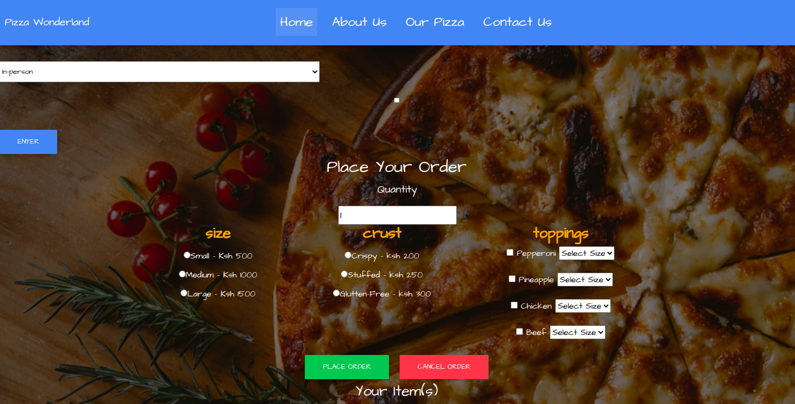

# pizza Wonderland
### By Dorothy Muhonja

## Description
 
 ## Set Up instructions 
### Requirement
* Code Editor i.e Visual Studio/Atom/Notepad
* Chrome or Safari web browser

### How To Run
* Click on this [Link](https://github.com/dorothymuhonja/pizza-project.git) to access my git hub pizza-project repositpory.
* Fork or Clone the repository
* You can also access the web application directly using this [live link](https://dorothymuhonja.github.io/pizza-project/)

## BDD(Behavior Driven Development)
* User can select a variety of pizzas with different toppings
* The app calculates a total for the pizza bought and displays it on the screen
* User have the option for an in person pick up or a home delivery
* For a hom e delivery the app prompts the user to enter their address
* The user get a notification about their total and delivery fee

## Technologies used
* html
* css
* Javascript
* JQuery
* Bootstrap
 
 ## Page Screenshot
 
 
 
 

## Contact information
* Email: dorothymuhonja7@gmail.com

## License and Copyright
Copyright (c) 2021 Dorothy Muhonja

[MIT License](LICENSE)
